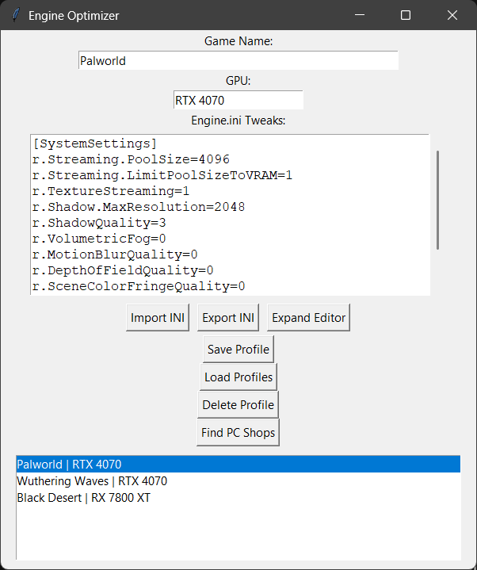

# Engine Optimizer

McMaster University **4SA3** (Software Architecture) project. A Tkinter desktop app for keeping game
`Engine.ini` tweaks organized by game and GPU, built around MVC and two design patterns.



*Shown with a sample profile.*

## Features

- Save, load and delete a profile per game with its GPU and `Engine.ini` tweaks
- Import and export `.ini` files, with an expanded editor for long configs
- Profiles stored in MongoDB through an **Object Pool** that reuses client connections
- **Strategy** pattern for exporting a profile as JSON or raw INI
- Google Maps Places search for nearby PC shops (top three results)

## Structure

| Folder | Role |
|---|---|
| `models/` | MongoDB connection pool and profile model; Google Maps API client |
| `views/` | Tkinter main window |
| `controllers/` | Connects the view to the models and export strategy |
| `strategies/` | JSON and INI export strategies |

## Tech

Python, Tkinter, MongoDB (pymongo), Google Maps Places API, python-dotenv

## Setup

```bash
pip install pymongo python-dotenv requests
cp .env.example .env   # then add your MongoDB connection string and Google API key
python main.py
```

`test_db.py` checks the MongoDB connection on its own.
